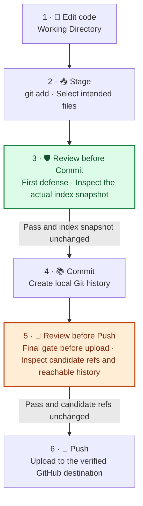

# GitHub Project Publisher

English | [简体中文](README.md)

A Codex GitHub publishing assistant for ordinary project authors. It can perform a read-only preflight, prepare repository-facing material, organize commits, connect or create a repository, push branches, and publish Releases. The workflow scales with the actual request and risk while preserving strong safeguards against sensitive-data leaks and accidental disclosure.

## Project status

This repository contains the GitHub Project Publisher skill source. The stable version recorded in this repository is [`v0.4.3`](https://github.com/cicada478/github-project-publisher/releases/tag/v0.4.3), with its changes documented in [RELEASE_NOTES.md](RELEASE_NOTES.md).

The current source also contains index scanning not yet included in a stable release (`--staged-only`) and two-stage review improvements. The related documentation below describes current source; a `v0.4.3` download does not include those improvements.

## Capabilities

- Separates audit-only, local preparation, repository publication, and Release publication modes.
- Reviews Git state, repository hygiene, file sizes, documentation completeness, license status, and remote targets.
- Flags common machine-local paths, including personal directories and R/Python installations, for portability and privacy review without echoing path values or automatically blocking publication.
- Reviews current content and historical text blobs reachable from the exact branches or Tags selected for publication; unrelated local branches, Tags, and stashes are not treated as upload candidates.
- Preparation can reuse content scans for tracked Blobs identical across the worktree and index/candidate history. The separate Commit and Push gates still run independently. The workflow reuses successful evidence only while the index snapshot, ref OIDs, identity policy, configuration, assets, destination, and other relevant inputs remain unchanged.
- Reviews publishable logs, HAR files, traces, dumps, crash reports, and source code that logs sensitive fields.
- Creates a new repository privately first when its intended end state is public; existing public repositories keep their established visibility and collaboration workflow.
- Applies Git identity policy when creating a commit or annotated Tag, or when an identity audit is explicitly requested. Existing contributors, bots, imported history, and Taggers are reported as provenance and do not block ordinary publication merely because they differ from the current publisher.
- Computes SHA-256 for every user-uploaded Release asset and compares it with GitHub's remote digest.
- Uses a decision matrix to distinguish no-question paths, binary confirmation, option cards, free-form questions, and host permissions; required decisions stop before mutation, no material option is dropped for UI capacity, and explains each outcome and material tradeoff, marking a recommendation only when evidence supports it.
- Drafts README and Release Notes from code, configuration, test, and history evidence without inventing features, compatibility, or performance claims; Release Notes default to Chinese and English with restrained emoji categories and an adaptable template.
- Organizes atomic commits with Conventional Commits, including scopes, bodies, footers, and breaking-change metadata.
- Respects the authorized scope of Commit, Push, Tag, and Release operations. Routine authorized steps do not require repeated confirmation; unresolved consequential choices, destructive operations, and a new destination becoming public follow separate decision rules.

## Workflow

```text
Inventory the project and identify candidate scope
  → prepare: scan worktree, index, and candidate history; run relevant project checks
  → prepare README and Release text as needed; rerun checks invalidated by edits
  → if a new Commit is needed: confirm identity → stage exact paths → Commit gate → Commit
  → publish: verify destination → run the Push gate on final refs → Push
  → compare remote refs with intended object IDs
  → for a Release: verify Tag, version, and notes; use a draft and compare digests for uploaded assets
  → for a new public destination: verify a fresh clone → obtain the final public-conversion decision
```

The workflow must stop when sensitive data is detected or a required check cannot complete. Risk reports include categories, safe locations, and remedies. Locations can be `path:line` or Blob/ref identifiers; repository-level findings may have no line number. Matched sensitive values are never echoed.

## 🛡️ Before Commit and Push: two review gates

**The Commit gate reviews risks before content enters local history; the Push gate reviews risks before candidate history is uploaded.** They inspect the actual index snapshot and final publication refs separately. Passing the Commit gate does not replace the Push gate. The diagram shows the path that creates a new Commit. Already committed candidates that need no edits proceed directly to the Push gate, without a synthetic Commit.



### Responsibilities of the script, Skill workflow, and CI

| Executor | Actual checks | Work that needs coordination |
| --- | --- | --- |
| `preflight.py` | Candidate enumeration, common sensitive-data patterns, filenames and sizes, basic repository files, Git email policy; reports findings and snapshot/ref identifiers | Does not run project tests, validate commit messages, verify remote ownership/visibility, or execute Commit/Push; results are not automatically persisted as reusable review records |
| Codex following the Skill | Reviews diffs, runs project validation, checks commit messages, performs contextual and format-specific review, verifies destination and authority, executes authorized operations, and records evidence | Must perform the checks and use their results; merely loading the Skill or receiving script exit code `0` does not pass the entire workflow |
| GitHub Actions | Compiles scripts, runs tests, and validates behavior cases on Push, PR, and manual runs; non-PR events also run strict committed-ref preflight | Runs remotely after upload; cannot prevent an upload that has already happened or replace the two local gates |

### What does each gate review?

| | 🛡️ Before Commit · First defense | 🔎 Before Push · Final gate before upload |
| --- | --- | --- |
| **Candidate** | Actual file content, paths, and modes in the index | Every planned branch/Tag and historical text Blob reachable from those refs |
| **Review focus** | Sensitive data, unintended files, commit identity and message; review `git diff --cached` and complete relevant project checks | Sensitive data in current content and history, scan completeness, exact push scope, destination, and visibility |
| **Scan mode** | `--staged-only --identity-policy noreply` (example using an already selected noreply identity) | `--committed-only --ref main` (specify and repeat `--ref` for the actual plan) |
| **Evidence** | `index_fingerprint` · Index snapshot fingerprint | `publication_ref_oids` · Object ID of each publication ref |
| **When to recheck** | After indexed content, paths, modes, identity, or other relevant inputs change | Required after committing; rerun when candidate refs, destination, or other relevant inputs change |

> **Why read the index?** Editing a staged file to remove a key, or deleting the worktree file, can leave its old content in the index. `--staged-only` reads indexed Blobs directly; project checks should also cover the actual commit candidate.
>
> **Why review history too?** Removing a key from the latest file can leave it in an older commit reachable from the planned refs. The Push gate covers that history, beyond the latest Commit. Unrelated local refs are excluded by default.

🚦 **Passing a gate:** Sensitive findings or incomplete required scans stop the corresponding operation. Successful evidence remains valid only while its inputs are unchanged. Reports never echo sensitive values; avoid exposing them when reviewing diffs too.

✅ **After Push:** Compare the remote branch/Tag object ID with the intended commit to verify the upload. These gates are executed by the Skill workflow and do not automatically install Git hooks. Post-push CI does not replace local Commit or Push review. See [direct preflight commands](#run-the-preflight-directly) and the [sensitive-data policy](github-project-publisher/references/sensitive-data-review.md).

## Standards and sources

This project does not treat a single blog post or personal preference as a universal standard. Each rule is grounded primarily in a formal specification or platform documentation and is translated into an executable check or workflow gate.

| Area | Project policy | Primary sources |
| --- | --- | --- |
| Skill structure and progressive disclosure | `SKILL.md` defines identity, activation, and workflow; detailed policy lives in `references/`, while deterministic checks live in `scripts/` | [OpenAI: Build skills](https://learn.chatgpt.com/docs/build-skills), [Agent Skills Specification](https://agentskills.io/specification) |
| GitHub repository governance | Require a README, effective ignore rules, applicable verification, and explicit license status; classify blockers, warnings, and advisories | [GitHub: Best practices for repositories](https://docs.github.com/en/repositories/creating-and-managing-repositories/best-practices-for-repositories), [project publication standards](github-project-publisher/references/standards.md) |
| README authorship | Explain purpose, value, installation, minimal use, support, maintenance status, and limitations; ground claims in repository evidence | [GitHub: About READMEs](https://docs.github.com/en/repositories/managing-your-repositorys-settings-and-features/customizing-your-repository/about-readmes), [project writing guide](github-project-publisher/references/writing-guide.md) |
| Sensitive-data and privacy gate | Inspect current files and historical blobs reachable from the exact candidate refs, plus credentials, personal information, payment data, captured logs, and sensitive logging calls; block candidate findings or incomplete required checks | [GitHub: Push protection](https://docs.github.com/en/code-security/concepts/secret-security/push-protection), [project sensitive-data review](github-project-publisher/references/sensitive-data-review.md) |
| Private-first visibility | Upload a newly created public destination privately first; preserve the visibility and collaboration workflow of existing repositories | [GitHub: Setting repository visibility](https://docs.github.com/en/repositories/managing-your-repositorys-settings-and-features/managing-repository-settings/setting-repository-visibility), [GitHub CLI: `gh repo create`](https://cli.github.com/manual/gh_repo_create), [safe publishing runbook](github-project-publisher/references/publishing-runbook.md) |
| Git identity privacy | Prefer the current account's `ID+USERNAME@users.noreply.github.com` for new workflow-created commits; allow a selected personal address with a warning; retain existing collaborative identities as provenance | [GitHub: Email addresses reference](https://docs.github.com/en/account-and-profile/reference/email-addresses-reference), [Git identity policy](github-project-publisher/references/identity-policy.md) |
| Human decision boundary | Use binary confirmation for a true proceed/cancel checkpoint and structured selection for how/which decisions; when `request_user_input` is available and the semantic test passes, call it directly; the Skill cannot enable Plan mode or host controls; trace deterministic defaults without asking | [OpenAI: Plan mode](https://developers.openai.com/blog/run-long-horizon-tasks-with-codex), [interaction and decision policy](github-project-publisher/references/interaction-policy.md) |
| Skill behavior verification | Maintain cases for direct, implicit, negative, incomplete-input, structured-card, host-permission, and blocker behavior; ordinary CI validates the corpus and optional manual CI runs live Codex evals | [OpenAI: Testing Agent Skills Systematically with Evals](https://developers.openai.com/blog/eval-skills), [behavior eval guide](evals/README.md) |
| Commit convention | Use `type(scope)!: subject`, optional body/footer, and `BREAKING CHANGE`; keep each commit focused on one intent | [Conventional Commits 1.0.0](https://www.conventionalcommits.org/en/v1.0.0/), [commitlint config-conventional](https://github.com/conventional-changelog/commitlint/tree/master/@commitlint/config-conventional), [project commit convention](github-project-publisher/references/commit-conventions.md) |
| Versioning | Map `fix`, `feat`, and breaking changes to PATCH, MINOR, and MAJOR only when the project declares a public API and adopts SemVer | [Semantic Versioning 2.0.0](https://semver.org/) |
| Release notes and publication | Bind each Release to an explicit Tag and target commit; require local SHA-256 and remote digest agreement for every user-uploaded asset | [GitHub: About releases](https://docs.github.com/en/repositories/releasing-projects-on-github/about-releases), [GitHub: Release assets API](https://docs.github.com/en/rest/releases/assets), [Keep a Changelog 1.1.0](https://keepachangelog.com/en/1.1.0/), [safe publishing runbook](github-project-publisher/references/publishing-runbook.md) |
| License identification | Never choose a license for the rights holder; after a choice is made, prefer the standard license text and SPDX identifiers | [SPDX License List](https://spdx.org/licenses/) |

## Repository layout

```text
.github/
└── workflows/
    └── ci.yml
evals/
├── cases.jsonl
├── README.md
├── result.schema.json
└── run_skill_evals.py
github-project-publisher/
├── SKILL.md
├── agents/
│   └── openai.yaml
├── references/
│   ├── commit-conventions.md
│   ├── identity-policy.md
│   ├── interaction-policy.md
│   ├── publishing-runbook.md
│   ├── sensitive-data-review.md
│   ├── standards.md
│   └── writing-guide.md
├── scripts/
│   ├── preflight.py
│   └── release_integrity.py
└── tests/
    ├── test_documentation.py
    └── test_preflight.py
```

## Requirements

- A Codex surface that supports local skills;
- Git;
- Python 3.10 or later;
- GitHub CLI for online identity resolution, GitHub repository operations, Releases, and remote verification. Default local preflight does not require it; browser use is only a fallback for authentication or a missing CLI capability.

The preflight and Release integrity scripts use only the Python standard library; remote Release verification also requires GitHub CLI.

## Installation

After downloading, place the complete `github-project-publisher` folder in either location:

- Project scope: `<project-root>\.codex\skills\github-project-publisher`
- User scope (global): `C:\Users\username\.codex\skills\github-project-publisher`

Ensure that `SKILL.md` is directly inside that folder, then start a new task or restart Codex.

## Usage

Explicit invocation is the most deterministic:

```text
$github-project-publisher Audit the current project for GitHub publication. Report findings only and do not modify files.
```

```text
$github-project-publisher Audit the current project, fix safe issues, and draft the README and Release text. Do not commit or upload anything.
```

```text
$github-project-publisher Publish this project safely to OWNER/REPOSITORY: upload and verify it privately, then ask me with a structured choice before converting it to public.
```

Implicit invocation is enabled in `agents/openai.yaml`, so a matching request may activate the skill without an explicit mention.

### Option cards and runtime mode

Option cards are rendered by the Codex host; they are not UI created by the Skill. For publication tasks that are likely to require decisions, enter Plan mode first. This gives the host an opportunity to expose structured input, but it does not turn every question into a card.

A card is used only when an unresolved material choice has at least two real mutually exclusive alternatives, changes authority, privacy, disclosure, compatibility, reversibility, or release meaning, and must be resolved before the next mutation. When `request_user_input` is available in the current turn, the Skill must call it directly and must not imitate a card with Markdown. When the tool is unavailable, the Skill cannot switch modes itself; it uses the narrowest interaction supported by the host and stops before the affected mutation.

## Run the preflight directly

From this repository root:

```powershell
python .\github-project-publisher\scripts\preflight.py .
```

The default command reads the worktree, index, non-ignored untracked files, and history reachable from `HEAD`. Its identity policy is `report` and requires no GitHub authentication. For the final Push gate, use `--committed-only` to exclude unrelated local work and repeat `--ref` for the actual publication plan (the following example applies only when both refs will be pushed):

```powershell
python .\github-project-publisher\scripts\preflight.py . --committed-only --ref main --ref v1.0.0
```

Before Commit, scan the actual index snapshot with the following command. This example uses an already selected noreply identity; use `--identity-policy configured` after explicitly choosing a personal email. In the current implementation, both strict identity policies require a verified GitHub account through `gh api user` or trusted CI account ID/login metadata, and inspect repository-local `user.email`; they do not configure identity automatically. See the review flow and comparison table above for the two stages.

```powershell
python .\github-project-publisher\scripts\preflight.py . --staged-only --identity-policy noreply
```

Before creating a commit with a noreply identity, use `--identity-policy noreply`; preflight then uses `gh api user` to verify ownership. If `gh` is not on `PATH`, pass its path:

```powershell
python .\github-project-publisher\scripts\preflight.py . --staged-only --identity-policy noreply --gh "C:\path\to\gh.exe"
```

Trusted CI may provide independently verified account metadata. This example checks indexed content and identity before creating a new Commit; do not derive account metadata from the commits under review:

```powershell
python .\github-project-publisher\scripts\preflight.py . --staged-only --identity-policy noreply --expected-github-id 12345678 --expected-github-login USERNAME
```

For JSON output:

```powershell
python .\github-project-publisher\scripts\preflight.py . --format json
```

Exit codes:

- `0`: the bundled scan found no blockers; warnings are allowed by default. Required contextual review and project checks still apply.
- `1`: blockers exist, including required scans reported as incomplete. With `--strict`, warnings also return `1`. Do not reuse this result as passing evidence.
- `2`: argument, path, or tool errors prevented command completion; treat the result as not passed.

Preflight defaults to `--identity-policy report` and scans the worktree, index, non-ignored untracked files, and `HEAD`; it does not block because existing contributor identities differ. Use `--committed-only` for the final push gate so only selected refs are candidates. Before creating a commit, use `--identity-policy noreply` or, after an explicit personal-email choice, `--identity-policy configured`. Use `--history-identity-policy strict` only for an explicitly requested single-identity or history-anonymization gate. Reports never print an address or matched sensitive value.

## Development and validation

```powershell
python -m unittest discover -s .\github-project-publisher\tests -v
python .\evals\run_skill_evals.py
```

The second command validates corpus structure and coverage without model usage. With an authenticated Codex CLI, run the live read-only behavior evals:

```powershell
python .\evals\run_skill_evals.py --execute
```

GitHub Actions runs deterministic checks on pushes, pull requests, and manual dispatches. The live Codex eval job starts only when a manual dispatch selects `run_live_evals` and requires an `OPENAI_API_KEY` repository secret. Missing credentials fail the job before live evals run. These evals assess interaction policy and do not perform real publication.

After uploading Release assets, run:

```powershell
python .\github-project-publisher\scripts\release_integrity.py OWNER/REPO TAG .\dist\asset.zip
```

List every user-uploaded asset. With no uploaded assets, omit file arguments and the script reports `not-applicable`.

## Security model

The scanner does not echo matching lines or sensitive values. Reports still contain repository paths, file locations, and Git object identifiers; review those metadata before sharing a report. If a real credential has entered Git history, revoke or rotate it first and let the repository owner assess history removal; do not improvise a force-push. See [SECURITY.md](SECURITY.md) for vulnerability reporting guidance.

## Limitations

- Pattern matching cannot prove that a repository contains no sensitive data.
- Indexed and historical text scans are limited to 25 MiB per Blob; oversized text blocks the gate. Binaries, images, archives, encrypted content, and proprietary formats still require manual or domain-specific inspection. An indexed submodule currently blocks with a request for separate review; the scanner does not recurse into submodules.
- Unrelated local refs are excluded by default. If the push plan uses `--all`, `--mirror`, or multiple refs, explicitly include every publication ref in the candidate review.
- This skill does not grant GitHub account access; publication still depends on local Git, GitHub CLI, or configured connector capabilities.
- Existing collaborative identities are retained as provenance by default. Only an explicitly requested strict single-identity review blocks mismatches; any history rewrite requires separate authorization.
- Repository-specific testing, build, licensing, and release policies take precedence over general guidance.

## License

This project is licensed under the [MIT License](LICENSE).
