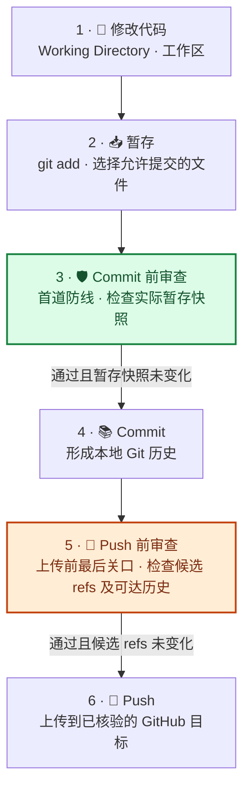

# GitHub Project Publisher

[English](README.en.md) | 简体中文

一个面向普通项目作者的 Codex GitHub 发布助手。它可以只做上传前审计，也可以整理文档、组织提交、连接或创建仓库、推送分支并发布 Release；流程会按项目和请求的实际风险调整强度，同时保留敏感信息与误公开防线。

## 项目状态

本仓库包含 GitHub Project Publisher 的 Skill 源码。已记录的稳定版本为 [`v0.4.3`](https://github.com/cicada478/github-project-publisher/releases/tag/v0.4.3)，该版本的变更见 [RELEASE_NOTES.md](RELEASE_NOTES.md)。

当前源码还包含尚未随稳定版发布的暂存区扫描（`--staged-only`）及两阶段审查改进；以下相关说明适用于当前源码，下载 `v0.4.3` 不包含这些改进。

## 核心能力

- 将任务区分为只读审计、本地准备、仓库发布和 Release 发布四种模式。
- 检查 Git 状态、仓库卫生、文件大小、文档完整性、许可证状态和远程目标。
- 对常见本地绝对路径给出可移植性与隐私提示，包括个人目录和 R/Python 安装路径；不回显路径值，不因路径本身自动阻断发布。
- 对精确发布分支或 Tag 的当前内容与历史文本 Blob 实施敏感信息审查；不会把无关本地分支、Tag 或 stash 自动视为待上传内容。
- 准备模式可对工作树与暂存区／候选历史中完全相同的已跟踪 Blob 复用内容扫描；独立的 Commit、Push 关卡仍分别执行。流程仅在暂存快照、ref OID、身份策略、配置、资产和目标等相关输入未变化时复用成功证据。
- 检查可发布日志、HAR、trace、dump、崩溃报告，以及源码中的敏感字段日志调用。
- 新建且最终需要公开的仓库先以 Private 上传和验证，公开转换作为独立最终决策；既有公开仓库沿用原有可见性和协作流程。
- 在创建新提交或附注 Tag，或明确请求身份审计时应用 Git 身份策略：推荐 GitHub ID 型 noreply，个人邮箱可选。既有贡献者、Bot、导入历史和 Tagger 身份作为来源信息报告，不因不同于当前发布者而阻断普通发布。
- 对每个用户上传的 Release 资产计算 SHA-256，并与 GitHub 返回的远端 digest 比对。
- 通过决策矩阵区分无需提问、二元确认、选项对话卡片、自由文本问题和宿主权限提示；该问的决策必须在变更前询问，卡片不得因界面容量遗漏实质方案，并说明各方案的结果与实质取舍；有证据支持时才标注推荐。
- 根据代码、配置、测试和历史证据撰写 README 与 Release Notes，禁止虚构功能、兼容性和性能结论；Release Notes 默认采用中英双语与适量 emoji 分类，并提供可裁剪模板。
- 使用 Conventional Commits 组织原子提交，并处理 `BREAKING CHANGE`、scope、body 和 footer。
- 遵守 Commit、Push、Tag 和 Release 的授权范围；已授权的常规操作不重复确认，未决的实质选择、破坏性操作和新仓库转为 Public 等按规则另行决定。

## 工作流

```text
项目盘点与候选范围确认
  → 准备：扫描工作区、暂存区与候选历史，执行相关项目检查
  → 按需准备 README 与 Release 文案，重跑受改动影响的检查
  → 若需新 Commit：确认身份 → 精确暂存 → Commit 前审查 → Commit
  → 发布：核验目标仓库 → 对最终 refs 执行 Push 前审查 → Push
  → 比对远端 refs 与预期对象 ID
  → 若需 Release：核验 Tag、版本和文案；有上传资产时先建 draft 并核对 digest
  → 新建且计划公开的仓库：全新克隆验证 → 最终确认转为 Public
```

发现敏感信息或必要检查失败时，工作流必须停止。风险报告包含类别、安全位置与处理建议；位置可为 `文件:行号`、Blob／ref 标识，仓库级问题也可能没有行号，不回显匹配到的敏感原值。

## 🛡️ Commit 前与 Push 前：两道审查关卡

**Commit 前检查内容进入本地历史的风险；Push 前检查候选历史上传的风险。** 两道关卡分别检查实际暂存快照和最终发布 refs，Commit 前的通过结果不能代替 Push 前审查。下图展示需要创建新 Commit 的路径；候选 refs 已提交且无需修改时，直接进入 Push 前审查，不人为创建额外 Commit。



### 脚本、Skill 流程与 CI 的分工

| 执行者 | 实际负责的检查 | 需要配合的工作 |
| --- | --- | --- |
| `preflight.py` | 枚举候选内容、常见敏感信息模式、文件名与大小、基础仓库文件、Git 邮箱策略；输出发现项及快照／ref 标识 | 不执行项目测试、提交说明校验、远端所有权／可见性核验或 Commit／Push；结果不会自动保存为可复用审查记录 |
| Codex 按 Skill 执行 | 审阅差异、按项目规则运行验证、检查提交说明、处理格式与上下文审查、核验目标及权限、执行获授权操作并记录证据 | 必须执行实际检查并依据结果放行；仅加载 Skill 或脚本返回 `0` 不代表整个流程已通过 |
| GitHub Actions | Push、PR、手动运行时编译脚本、运行测试并校验行为语料；非 PR 事件还运行严格 committed-ref 预检 | 属于远端 CI；不能阻止已发生的上传，也不能替代本地两道关卡 |

### 两道关卡分别审什么？

| | 🛡️ Commit 前 · 首道防线 | 🔎 Push 前 · 上传前最后关口 |
| --- | --- | --- |
| **检查对象** | 暂存区（Index）中的实际文件内容、路径和模式 | 所有计划推送的分支／Tag，以及从它们可达的历史文本 Blob |
| **审查重点** | 敏感信息、意外文件、提交身份、提交说明；审阅 `git diff --cached` 并完成相关项目检查 | 当前内容与历史中的敏感信息、扫描完整性、准确的推送范围、远程目标与可见性 |
| **扫描模式** | `--staged-only --identity-policy noreply`（示例采用已选定的 noreply 身份） | `--committed-only --ref main`（按实际计划指定并重复 `--ref`） |
| **通过证据** | `index_fingerprint` · 暂存快照指纹 | `publication_ref_oids` · 每个发布 ref 的对象 ID |
| **何时重审** | 暂存内容、路径、模式或身份等相关输入改变后 | Commit 完成后必须执行；候选 ref、目标或相关输入改变后重审 |

> **为什么要读暂存区？** 文件暂存后，即使你把工作区中的密钥删除或把文件改安全了，暂存快照仍可能保留旧内容。`--staged-only` 直接读取暂存 Blob；项目测试也应覆盖实际待提交内容。
>
> **为什么还要查历史？** 密钥从最新文件中删除后，仍可能存在于待推送 refs 可达的旧提交中。Push 前审查覆盖这些历史，而不只看最后一次 Commit；无关本地 refs 默认不纳入发布审查。

🚦 **放行规则：** 敏感信息命中或必要扫描不完整时，停止对应操作；通过的检查仅在其输入未变化时有效。报告不回显敏感原值，审阅差异时也应避免将它们输出到报告中。

✅ **Push 后核验：** 比对远端分支／Tag 与预期提交的对象 ID，确认上传结果。两道关卡由 Skill 流程执行，不会自动安装 Git hooks；推送后触发的 CI 不能替代本地 Commit 前或 Push 前审查。独立命令见[独立运行预检](#独立运行预检)，详细规则见[敏感信息审查](github-project-publisher/references/sensitive-data-review.md)。

## 规范依据与来源

本项目没有将单一博客或个人习惯视为通用标准。各项规则优先依据正式规范和平台官方文档，并在 Skill 内转化为可执行检查或操作门禁。

| 规范领域 | 本项目采用方式 | 主要依据 |
| --- | --- | --- |
| Skill 结构与渐进式加载 | `SKILL.md` 声明名称、触发描述和工作流；细则拆分到 `references/`，确定性检查放入 `scripts/` | [OpenAI：Build skills](https://learn.chatgpt.com/docs/build-skills)、[Agent Skills Specification](https://agentskills.io/specification) |
| GitHub 仓库治理 | 要求 README、有效忽略规则、必要验证、明确许可证状态，并区分阻断项、警告项与建议项 | [GitHub：Best practices for repositories](https://docs.github.com/en/repositories/creating-and-managing-repositories/best-practices-for-repositories)、[项目发布标准](github-project-publisher/references/standards.md) |
| README 撰写 | 说明项目用途、价值、安装、最小用例、支持方式、维护状态和限制；所有结论必须有项目证据 | [GitHub：About READMEs](https://docs.github.com/en/repositories/managing-your-repositorys-settings-and-features/customizing-your-repository/about-readmes)、[本项目写作指南](github-project-publisher/references/writing-guide.md) |
| 敏感信息与隐私门禁 | 检查精确候选 refs 的当前文件与历史 Blob，以及凭证、个人信息、支付数据、日志成品和敏感日志调用；候选内容命中或必要检查失败时阻止发布 | [GitHub：Push protection](https://docs.github.com/en/code-security/concepts/secret-security/push-protection)、[本项目敏感信息审查](github-project-publisher/references/sensitive-data-review.md) |
| Private-first 可见性 | 新建且计划公开的仓库先 Private 上传和验证；既有仓库保留其可见性和协作方式 | [GitHub：Setting repository visibility](https://docs.github.com/en/repositories/managing-your-repositorys-settings-and-features/managing-repository-settings/setting-repository-visibility)、[GitHub CLI：`gh repo create`](https://cli.github.com/manual/gh_repo_create)、[安全发布手册](github-project-publisher/references/publishing-runbook.md) |
| Git 提交邮箱隐私 | 为本工作流创建的新提交优先使用当前账户的 `ID+USERNAME@users.noreply.github.com`；个人邮箱需接受公开风险；既有协作身份默认保留并作为来源信息报告 | [GitHub：Email addresses reference](https://docs.github.com/en/account-and-profile/reference/email-addresses-reference)、[Git 身份策略](github-project-publisher/references/identity-policy.md) |
| 人机决策边界 | “做不做”使用必要的二元确认，“怎么做/选哪个”必须使用结构化选择；当 `request_user_input` 可用且语义条件满足时必须真实调用；Skill 不能自行开启 Plan 模式或宿主控件；确定性默认动作自动执行但记录依据、范围和结果 | [OpenAI：Plan mode](https://developers.openai.com/blog/run-long-horizon-tasks-with-codex)、[交互与决策策略](github-project-publisher/references/interaction-policy.md) |
| Skill 行为验证 | 以直接触发、隐式触发、负向触发、不完整输入、结构化卡片、宿主权限和阻断场景组成行为语料；普通 CI 校验语料，手动 CI 可运行真实 Codex eval | [OpenAI：Testing Agent Skills Systematically with Evals](https://developers.openai.com/blog/eval-skills)、[行为 eval 说明](evals/README.md) |
| Commit 规范 | 使用 `type(scope)!: subject`、可选 body/footer 和 `BREAKING CHANGE`；提交必须保持单一意图 | [Conventional Commits 1.0.0](https://www.conventionalcommits.org/en/v1.0.0/)、[commitlint config-conventional](https://github.com/conventional-changelog/commitlint/tree/master/@commitlint/config-conventional)、[本项目 Commit 规范](github-project-publisher/references/commit-conventions.md) |
| 版本规则 | 仅在项目声明公共 API 和 SemVer 政策时，将 `fix`、`feat`、破坏性变更分别映射到 PATCH、MINOR、MAJOR | [Semantic Versioning 2.0.0](https://semver.org/) |
| Release 文案与版本发布 | Release 必须绑定明确 Tag 和目标提交；所有用户上传资产必须通过本地 SHA-256 与远端 digest 一致性验证 | [GitHub：About releases](https://docs.github.com/en/repositories/releasing-projects-on-github/about-releases)、[GitHub：Release assets API](https://docs.github.com/en/rest/releases/assets)、[Keep a Changelog 1.1.0](https://keepachangelog.com/en/1.1.0/)、[安全发布手册](github-project-publisher/references/publishing-runbook.md) |
| 许可证标识 | 不替权利人选择许可证；选择后优先使用标准许可证全文与 SPDX 标识 | [SPDX License List](https://spdx.org/licenses/) |

## 目录结构

```text
.github/
└── workflows/
    └── ci.yml
evals/
├── cases.jsonl
├── README.md
├── result.schema.json
└── run_skill_evals.py
github-project-publisher/
├── SKILL.md
├── agents/
│   └── openai.yaml
├── references/
│   ├── commit-conventions.md
│   ├── identity-policy.md
│   ├── interaction-policy.md
│   ├── publishing-runbook.md
│   ├── sensitive-data-review.md
│   ├── standards.md
│   └── writing-guide.md
├── scripts/
│   ├── preflight.py
│   └── release_integrity.py
└── tests/
    ├── test_documentation.py
    └── test_preflight.py
```

## 环境要求

- 支持本地 Skills 的 Codex；
- Git；
- Python 3.10 或更高版本；
- 需要在线身份解析、GitHub 仓库操作、Release 或远端校验时，使用 GitHub CLI；仅运行默认本地预检不需要它。浏览器只作为认证或缺失能力的后备方案。

预检脚本和 Release 完整性验证脚本只使用 Python 标准库；远端 Release 验证还需要 GitHub CLI。

## 安装

下载后，将完整的 `github-project-publisher` 文件夹放到以下任一位置：

- 项目级：`<项目根目录>\.codex\skills\github-project-publisher`
- 用户级（全局）：`C:\Users\username\.codex\skills\github-project-publisher`

确保 `SKILL.md` 直接位于该文件夹内，然后重新打开任务或重启 Codex。

## 使用

显式调用最确定：

```text
$github-project-publisher 检查当前项目，只输出上传前审计报告，不修改文件。
```

```text
$github-project-publisher 检查当前项目，修复可安全处理的问题，撰写 README 和 Release 文案，但不要提交或上传。
```

```text
$github-project-publisher 将当前项目安全发布到 OWNER/REPOSITORY：先以 private 上传和验证，在最终转为 public 前用对话式选项询问我。
```

`agents/openai.yaml` 允许隐式调用，因此“检查项目并准备上传 GitHub”等请求也可能自动启用本 Skill。

### 选项卡与运行模式

选项卡由 Codex 宿主提供，不是 Skill 自己生成的界面。建议在需要发布决策的任务中先进入 Plan 模式；这会让宿主有机会提供结构化输入，但不代表每个问题都会变成卡片。

只有同时满足以下条件时才使用选项卡：存在尚未决定的实质选择；至少有两个真实、互斥的方案；选择会改变权限、隐私、公开范围、兼容性、可逆性或发布含义；并且在继续变更前必须获得选择。当当前回合提供 `request_user_input` 时，Skill 必须直接调用它，不能用 Markdown 模拟卡片。工具不可用时，Skill 不能自行切换 Plan 模式，只能按宿主允许的方式提问，并在获得明确答案前停止相关变更。

## 独立运行预检

从本仓库根目录执行：

```powershell
python .\github-project-publisher\scripts\preflight.py .
```

默认命令只读扫描工作区、暂存区、非忽略未跟踪文件和 `HEAD` 可达历史；身份策略为 `report`，不要求 GitHub 登录。最终 Push 前用 `--committed-only` 排除无关本地工作，并用可重复的 `--ref` 指定实际计划发布的分支或 Tag（以下示例仅适用于两者都要推送的情况）：

```powershell
python .\github-project-publisher\scripts\preflight.py . --committed-only --ref main --ref v1.0.0
```

Commit 前使用以下命令扫描实际暂存快照。此处示例使用已选定的 noreply 身份；已明确选择个人邮箱时改用 `--identity-policy configured`。当前实现中，这两种严格身份策略都需要已核验的 GitHub 账户（通过 `gh api user`，或可信 CI 提供账户 ID 与登录名），并检查仓库级 `user.email`；不会自动配置身份。两阶段职责见上方审查流程图与对照表。

```powershell
python .\github-project-publisher\scripts\preflight.py . --staged-only --identity-policy noreply
```

在创建提交前选择 noreply 身份时，使用 `--identity-policy noreply`；预检会通过 `gh api user` 验证地址属于当前认证账户。如果 `gh` 不在 `PATH`，可传入：

```powershell
python .\github-project-publisher\scripts\preflight.py . --staged-only --identity-policy noreply --gh "C:\path\to\gh.exe"
```

可信 CI 可以显式传入独立核验的账户信息。以下为创建新 Commit 前的暂存区身份检查示例；不要从待检查提交反推账户信息：

```powershell
python .\github-project-publisher\scripts\preflight.py . --staged-only --identity-policy noreply --expected-github-id 12345678 --expected-github-login USERNAME
```

JSON 输出：

```powershell
python .\github-project-publisher\scripts\preflight.py . --format json
```

退出码：

- `0`：内置扫描未发现阻断项；默认允许警告，仍需处理必要的上下文审查并执行项目专属检查。
- `1`：存在阻断项（包括以发现项报告的必要扫描不完整）；使用 `--strict` 时，警告也返回 `1`。不得将该结果作为通过证据。
- `2`：参数、路径或工具调用等错误导致命令未完成，按未通过处理。

预检默认使用 `--identity-policy report`，扫描当前工作树、暂存区、非忽略未跟踪文件和 `HEAD`，不会因既有贡献者身份不同而阻断。最终推送前使用 `--committed-only` 将门禁限定到指定 refs。创建新提交前使用 `--identity-policy noreply` 或在明确选择个人邮箱后使用 `--identity-policy configured`。只有用户明确要求单作者或历史匿名化门禁时才加 `--history-identity-policy strict`。报告不会回显实际邮箱或敏感值。

## 开发与验证

```powershell
python -m unittest discover -s .\github-project-publisher\tests -v
python .\evals\run_skill_evals.py
```

第二条命令只验证行为语料的结构和覆盖面，不使用模型额度。已登录 Codex CLI 后，可执行真实的只读行为 eval：

```powershell
python .\evals\run_skill_evals.py --execute
```

GitHub Actions 在 push、pull request 和手动运行时执行确定性测试；真实 Codex eval 的任务仅在手动选择 `run_live_evals` 时启动，任务要求仓库配置 `OPENAI_API_KEY`；缺失凭证时失败，不会运行真实 eval。这些 eval 评估交互策略，不执行真实发布。

Release 资产上传后执行：

```powershell
python .\github-project-publisher\scripts\release_integrity.py OWNER/REPO TAG .\dist\asset.zip
```

必须列出该 Release 的全部用户上传资产；没有附件时省略文件参数，脚本会报告 `not-applicable`。

## 安全模型

扫描器不回显匹配行或敏感值；报告仍包含仓库路径、文件位置和 Git 对象标识，分享报告前应审阅这些元数据。真实凭证如果进入过 Git 历史，应先撤销或轮换，再由仓库所有者评估历史清理；不得通过强制推送临时掩盖问题。安全问题的报告方式见 [SECURITY.md](SECURITY.md)。

## 局限性

- 模式扫描无法证明项目绝对不存在敏感信息。
- 暂存区与历史模式的内置文本扫描上限为单个 Blob 25 MiB，超限文本会阻断；二进制、图片、压缩包、加密内容和专有格式仍需人工或领域工具检查。暂存区包含 submodule 时，当前扫描器以需要单独审查为由阻断，不递归扫描子模块。
- 无关本地 refs 默认不扫描；如果计划执行 `--all`、`--mirror` 或多 ref 推送，必须显式把它们纳入候选审查。
- 本 Skill 不自带 GitHub 账户权限；发布仍依赖本机 Git、GitHub CLI 或已配置的连接能力。
- 既有协作身份默认作为来源信息保留。只有明确请求严格单身份历史审查时才阻断不匹配身份；任何历史重写都必须另行授权。
- 仓库专属的测试、构建、许可证和发布策略始终优先于通用建议。

## 许可证

本项目采用 [MIT 许可证](LICENSE)。
